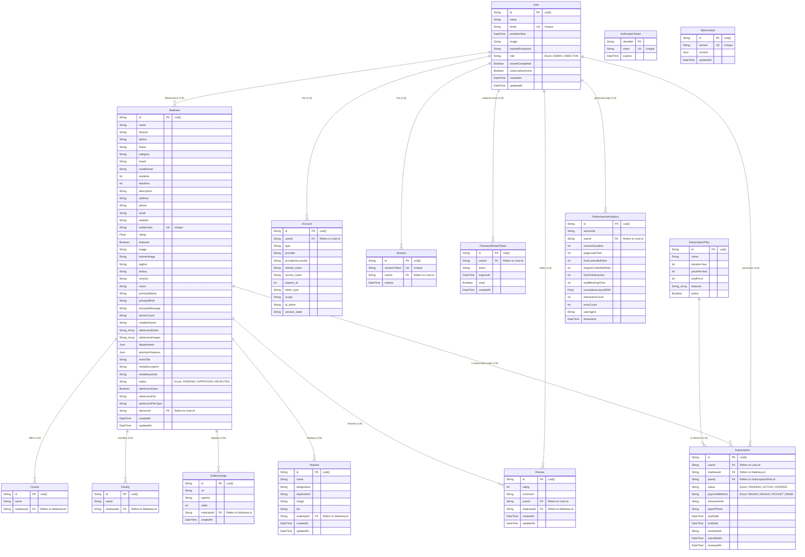

# Database Entity Relationship Diagram (ERD)
এই ডকুমেন্টে মডার্ন মাদ্রাসা হাবের ডেটাবেজ আর্কিটেকচার এবং রিলেশনশিপগুলো Mermaid.js ব্যবহার করে ভিজ্যুয়ালাইজ করা হয়েছে।

## 📊 ER Diagram (Mermaid.js)

## 🔍 রিলেশনশিপ বিশ্লেষণ (Relationship Analysis)

### ১. User (মাদ্রাসা ওনার/ডিরেক্টর) কেন্দ্রিক রিলেশন (1:N)
- **User -> Madrasa**: একজন ডিরেক্টরের অধীনে একাধিক মাদ্রাসা থাকতে পারে। (`directorId` ফরেন কি)।
- **User -> Subscription**: একজন ইউজার একাধিকবার সাবস্ক্রিপশন কিনতে পারেন (রিনিউ করার ক্ষেত্রে)। (`userId` ফরেন কি)।
- **User -> Review**: একজন ইউজার বিভিন্ন মাদ্রাসায় রিভিউ দিতে পারেন। (`userId` ফরেন কি)।

### ২. Madrasa কেন্দ্রিক রিলেশন (1:N)
- **Madrasa -> Course / Facility / GalleryImage / Teacher**: একটি মাদ্রাসার অধীনে একাধিক কোর্স, সুবিধা, গ্যালারি ছবি এবং শিক্ষক থাকতে পারে। এই চাইল্ড টেবিলগুলোতে `madrasaId` ফরেন কি হিসেবে কাজ করছে এবং এখানে `onDelete: Cascade` ব্যবহার করা হয়েছে, অর্থাৎ মাদ্রাসা ডিলিট হলে এগুলোও মুছে যাবে।
- **Madrasa -> Review**: একটি মাদ্রাসায় একাধিক ইউজার রিভিউ দিতে পারেন। (`madrasaId` ফরেন কি)।

### ৩. Subscription কেন্দ্রিক রিলেশন (1:N)
- **SubscriptionPlan -> Subscription**: একটি সাবস্ক্রিপশন প্ল্যানের (যেমন: 'Yearly Premium') অধীনে একাধিক সাবস্ক্রিপশন পারচেজ এন্ট্রি থাকতে পারে। (`planId` ফরেন কি)।

### 🔑 প্রাইমারি ও ইউনিক কি (Keys & Constraints)
- **PK (Primary Key):** সব টেবিলেই `id` কলামটি প্রাইমারি কি হিসেবে ব্যবহৃত হয়েছে এবং ডাটা টাইপ হিসেবে `cuid()` জেনারেট হচ্ছে।
- **UK (Unique Key):** 
  - `User` টেবিলে `email` ইউনিক।
  - `Madrasa` টেবিলে `subdomain` ইউনিক (যাতে একই সাব-ডোমেইন দুজন না পায়)।
  - `SiteContent` টেবিলে `section` ইউনিক।

এই ডায়াগ্রামটি ব্যবহার করে যেকোনো ডেভেলপার সহজেই প্রজেক্টের ডেটাবেজ আর্কিটেকচার বুঝতে পারবেন।